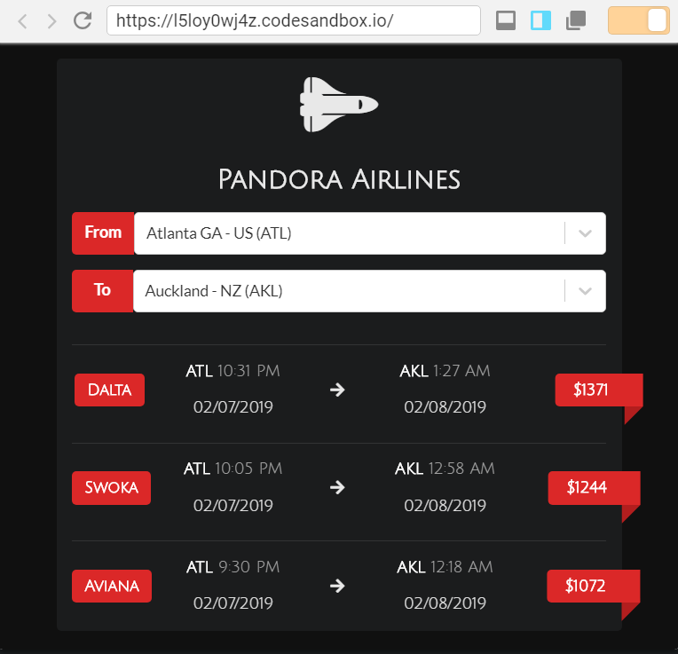

# Airline-Widget
A React-Redux widget made with the help of redux-thunk.
Project is live at https://awesomechap.github.io/Airline-Widget/

# Preview

   

## Available Scripts

In the project directory, you can run:

### `npm start`

Runs the app in the development mode. 
Open [http://localhost:3000](http://localhost:3000) to view it in the browser.

The page will reload if you make edits. 
You will also see any lint errors in the console.
